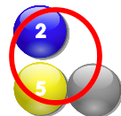

# [PrimeOrdeal][link]
[link]: http://makenneth.github.io/PrimeOrdeal/

## Goal
- This is a mathematics puzzle involving addition and prime number.
- Balls will keep falling from the sky.
- Your task is to clear bubbles as quickly as you can.
- You have seven turns to clear bubbles before more hidden bubbles fall from the sky.

### Controls
- Tap on &larr;  &rarr; to decide where the ball should be dropped.
- Tap space to drop a ball quickly

### Rules
- Balls can be clear if:
    -  all the balls connected (unidirectionally) to each other sum up to a prime.
    -  two or more balls are in the chain
    -  vertically there can be no hidden balls
    -  hidden balls has no effect on rows
    -  hidden balls are counted as one end of the row

- Hidden ball will be revealed if any of its surrounding balls get cleared

