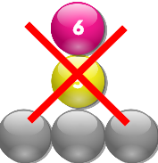
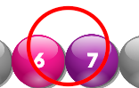

# [PrimeOrdeal][link]
[link]: http://www.primeordeal.online

## Goal
This game is a Math addition and prime exercise.
Balls will keep falling from the sky.
Your task is to clear bubbles as quickly as you can. 
You have seven turns to clear bubbles before more hidden bubbles fall from the sky.

- Balls can be clear if all the balls (two or more) next to each other sum up to a prime.
- Balls can only be clear in columns if there are no hidden balls in the column.
- Balls in rows can be clear even with hidden balls
- Tap on &larr;  &rarr; to decide where the ball should be dropped.
- Tap space to drop a ball quickly

